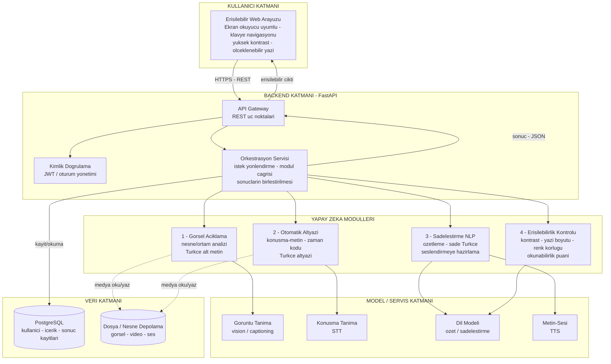

# Sistem Mimarisi — Erişilebilir Destek

Bu belge, **Erişilebilir Destek** platformunun backend ve entegrasyon mimarisini tanımlar.
Platform; paylaşılan görsel, video ve metin içeriklerini yapay zeka modülleriyle işleyerek
erişilebilir çıktılar (Türkçe alt metin, altyazı, sade metin, erişilebilirlik puanı) üretir.

## Katmanlı mimari şeması

## Veri akışı

1. **İstek** — Kullanıcı, erişilebilir arayüzden bir görsel, video veya metin gönderir. İstek HTTPS üzerinden backend'in API Gateway'ine ulaşır.
2. **Doğrulama & yönlendirme** — Kimlik doğrulama (JWT) geçilir; Orkestrasyon Servisi isteğin türüne göre onu ilgili yapay zeka modülüne yönlendirir.
3. **İşleme** — İlgili modül, altındaki modeli (görüntü tanıma, STT, dil modeli, TTS) çağırarak Türkçe çıktıyı üretir; medya dosyaları depolamadan okunur/yazılır.
4. **Birleştirme & kayıt** — Orkestrasyon, modül çıktısını toparlar, sonucu PostgreSQL'e kaydeder ve JSON olarak Gateway'e döndürür.
5. **Erişilebilir çıktı** — Gateway sonucu arayüze iletir; kullanıcı alt metni, altyazıyı, sade metni veya erişilebilirlik puanını erişilebilir biçimde görür.

## Teknoloji notu

Backend **FastAPI (Python)**, veritabanı **PostgreSQL** olarak planlanmıştır. Yapay zeka modülleri
backend'den bağımsız servisler olarak konumlanır; ortak bir **API sözleşmesiyle** (girdi/çıktı formatı)
Orkestrasyon Servisine bağlanır. Böylece her modül ayrı geliştirilip tek sistemde birleştirilir.

> Bu şema başlangıç mimarisidir; teknoloji seçimleri PoC aşamasında (20 Ağustos) netleştirilecektir.
