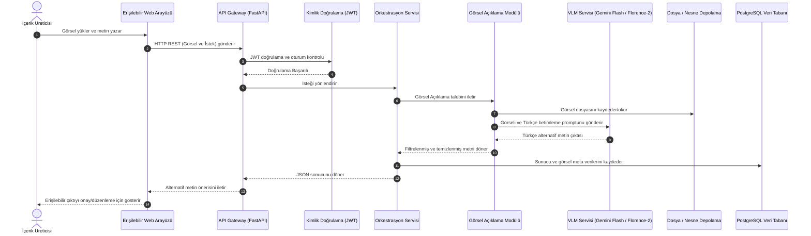

# Görsel Alternatif Metin (Alt-Text) Yaklaşımı ve Model Karşılaştırma Notu
**Hazırlayan:** Zeynep Ecren (Yazılım ve Backend Sorumlusu)  
**Proje:** NSosyal Erişilebilir Destek  

Bu çalışma, sosyal medya görselleri için otomatik, anlamlı ve erişilebilirlik standartlarına (W3C/WCAG) uygun Türkçe alternatif metin (alt-text) üretme yaklaşımını ve kullanılacak Vision-Language (VLM) modellerinin teknik karşılaştırmasını içermektedir.

---

## 1. Görsel Alternatif Metin Yaklaşımı (İş Akışı ve Standartlar)

Görsel alternatif metin üretimi, sadece resimdeki nesneleri listelemek değildir. Ekran okuyucu (Screen Reader) kullanan görme engelli bir bireye, görselin sosyal medyadaki **bağlamını, duygusunu ve iletmek istediği mesajı** doğru aktarma sürecidir.

### A. W3C Standartlarına Uygun Betimleme Kuralları
1. **Gereksiz İfadelerin Elenmesi:** Ekran okuyucular görseli okurken zaten "Resim:" veya "Görsel:" şeklinde anons eder. Bu nedenle alternatif metinler asla *"Bu resimde..."*, *"Bir ... fotoğrafı"* gibi ifadelerle **başlamamalıdır.**
2. **Bağlam ve Eylem Odaklılık:** Nesnelerin sadece adı değil, ilişkileri ve eylemleri de yazılmalıdır.
   * *Kötü Alt-Text:* "Kedi ve masa."
   * *İyi Alt-Text:* "Mutfak masasındaki laptopun yanına kıvrılmış uyuyan tekir bir kedi."
3. **Metin Okuma (OCR Entegrasyonu):** Görselin içinde yazı veya afiş metni varsa, bu metinler alternatif açıklamaya mutlaka dahil edilmelidir.

### B. Teknik İş Akışı ve Sistem Mimarisi Entegrasyonu

Geliştirilecek olan görsel alternatif metin üretim akışı, FastAPI tabanlı backend mimarisi ve veri akış şemasıyla tam uyumlu olarak kurgulanmıştır.

#### Veri Akış Adımları:
1. **İstek (Request):** Kullanıcı, erişilebilir kullanıcı arayüzünden (UI) görseli yükler. İstek, HTTPS/REST üzerinden FastAPI backend katmanındaki **API Gateway**'e ulaşır.
2. **Doğrulama & Yönlendirme (Auth & Routing):** JWT token doğrulamasından sonra **Orkestrasyon Servisi**, isteği türüne göre "Görsel Açıklama" modülüne iletir.
3. **İşleme & Depolama (Processing):** Modül, görseli **Dosya / Nesne Depolaması**na (Object Storage) yazar. Ardından seçilen **VLM (Yapay Zekâ)** modelini (Gemini 3.6 Flash veya Florence-2) Türkçe prompt ile çağırarak betimlemeyi üretir.
4. **Kayıt & Birleştirme (Database & JSON):** Orkestrasyon Servisi gelen çıktıyı filtrelerden geçirir, **PostgreSQL** veri tabanına kaydeder ve API Gateway üzerinden JSON formatında arayüze iletir.
5. **Erişilebilir Çıktı (Output Preview):** Arayüz, otomatik hazırlanan alternatif metin önerisini içerik üreticisine gösterir. Üretici onayladığında gönderi erişilebilir meta verisiyle birlikte yayına hazır hale gelir.

---

## 2. Model Seçenekleri ve Karşılaştırmalı Analiz

Projede kullanabileceğimiz modeller **Bulut Tabanlı API Servisleri** ve **Açık Kaynaklı / Yerel (Local) Modeller** olarak ikiye ayrılmaktadır:

### A. GPT-4o (OpenAI API)
* **Yapısı:** Kapalı Kaynak / Bulut API
* **Türkçe Performansı:** Mükemmel. Türkçe dilinin semantik ve kültürel yapısına en uygun betimlemeleri üreten modeldir.
* **Bağlam Anlayışı:** Görseldeki ince detayları, duyguyu ve metinleri (OCR) çok yüksek doğrulukla algılar.
* **Gecikme & Maliyet:** Ortalama gecikme süresi 1.5 - 2.5 saniyedir. İstek başına maliyeti (Token ücreti) açık kaynaklı modellere göre yüksektir.

### B. Gemini 3.6 Flash (Google API)
* **Yapısı:** Kapalı Kaynak / Bulut API
* **Türkçe Performansı:** Çok İyi. Türkçe çıktı kalitesi GPT-4o'ya oldukça yakındır.
* **Bağlam Anlayışı:** Multimodal (çoklu modlu) mimarisi sayesinde görsel içi yazıları ve nesneleri başarıyla ayrıştırır.
* **Gecikme & Maliyet:** **En hızlı API modelidir (Ortalama 0.8 - 1.2 saniye gecikme).** Maliyeti GPT-4o'ya kıyasla oldukça düşüktür ve ücretsiz kullanım limitleri (Free Tier) mevcuttur.

### C. Qwen2-VL-7B-Instruct (Alibaba - Açık Kaynak)
* **Yapısı:** Açık Kaynak / Lokal veya Colab üzerinde çalıştırılabilir
* **Türkçe Performansı:** İyi. Çok dilli (Multilingual) olarak eğitildiği için Türkçe görsel betimlemede açık kaynaklı modeller arasında en başarılı olanlardandır.
* **Bağlam Anlayışı:** 7 milyar parametreli yapısıyla nesne konumlarını ve metinleri iyi analiz eder.
* **Gecikme & Maliyet:** Yerel GPU (VRAM > 16GB) veya ücretsiz Google Colab (T4 GPU) üzerinde çalıştırılabilir. API maliyeti yoktur ancak yerel sunucu kurulumu gerektirir.

### D. LLaVA-1.5-13B (Açık Kaynak)
* **Yapısı:** Açık Kaynak / Lokal
* **Türkçe Performansı:** Orta. Görselleri çok iyi analiz eder ancak Türkçe betimleme üretirken bazen İngilizce kelimeler karıştırabilir veya dilbilgisi hataları yapabilir.
* **Bağlam Anlayışı:** Nesne tespiti başarılıdır ancak görsel içindeki küçük Türkçe yazıları okumakta (OCR) zorlanır.
* **Gecikme & Maliyet:** 13B sürümü için güçlü bir ekran kartı gerekir. Sunucu maliyeti yüksektir.

### E. Florence-2-Large (Microsoft - Açık Kaynak & Ultra Hafif)
* **Yapısı:** Açık Kaynak / Lokal (Sadece 0.7B parametre)
* **Türkçe Performansı:** Zayıf. Doğrudan Türkçe çıktı veremez, çıktısı İngilizce'dir. Türkçe için arkasına bir çeviri modeli (örn: NLLB-200) koymak gerekir.
* **Bağlam Anlayışı:** Boyutuna göre inanılmaz derecede başarılıdır. Nesne tespiti, detaylı betimleme ve OCR yeteneği çok gelişmiştir.
* **Gecikme & Maliyet:** **Neredeyse sıfır maliyet ve ultra hızlıdır (yerel CPU'da bile < 0.2 saniyede çalışır).** Cep telefonunda bile çalışabilir.

---

## 3. Model Karşılaştırma Tablosu

| Kriter | GPT-4o (API) | Gemini 3.6 Flash (API) | Qwen2-VL-7B (Lokal) | Florence-2 (Lokal + Çeviri) |
| :--- | :--- | :--- | :--- | :--- |
| **Türkçe Dil Kalitesi** | 5/5 (Mükemmel) | 4.5/5 (Çok Başarılı) | 4/5 (Başarılı) | 3/5 (Orta - Çeviri Bağımlı) |
| **Bağlam ve Detay Analizi**| 5/5 | 4.5/5 | 4/5 | 3.5/5 |
| **OCR (Görsel İçi Yazı)** | 5/5 | 4.5/5 | 4/5 | 3/5 |
| **Gecikme Süresi (Hız)** | ~2.0 sn | **~1.0 sn (Hızlı)** | ~3.0 sn (GPU'ya Bağlı) | **~0.2 sn (Ultra Hızlı)** |
| **Maliyet / API Ücreti** | Yüksek | Çok Düşük (Free Tier var)| **Ücretsiz (Açık Kaynak)** | **Ücretsiz (Açık Kaynak)** |
| **Donanım İhtiyacı** | Yok (Bulut) | Yok (Bulut) | Yüksek GPU (16GB VRAM) | Ultra Düşük (CPU yeterli) |

---

## 4. Proje ve MVP İçin Teknik Model Tavsiyesi

### **Öneri: Gemini 3.6 Flash (Bulut API) + Florence-2 (Lokal Yedek/Alternatif)**

1. **MVP (Prototip) Aşaması İçin:**
   * Prototip aşamasında sunucu maliyetleri ve donanım kurulumlarıyla zaman kaybetmemek adına **Gemini 3.6 Flash API** kullanımı en mantıklı seçimdir. 
   * **Gerekçesi:** Çok hızlı yanıt vermesi (kullanıcı deneyimini artırır), Türkçe dil kalitesinin jüriyi etkileyecek düzeyde yüksek olması ve Google'ın sunduğu ücretsiz API limitlerinin prototip testleri için fazlasıyla yeterli olmasıdır.

2. **Nihai Ürün (Sürdürülebilirlik & Yerlilik) Aşaması İçin:**
   * Raporun *"Sürdürülebilirlik"* ve *"Yerlilik"* puanını artırmak için sisteme açık kaynaklı bir **Florence-2 (Lokal)** veya **Qwen2-VL** seçeneği eklenecektir.
   * **Gerekçesi:** Kurumsal müşterilere veya kamu kurumlarına *"Verileriniz buluta gitmeden tamamen kendi yerel sunucumuzda açık kaynaklı modellerle işlenmektedir"* güvencesini (Veri Güvenliği ve Etik İlkeler - Bölüm 10) sunmamızı sağlar.
