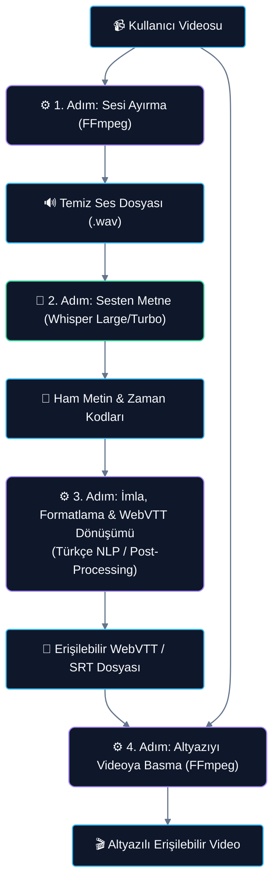
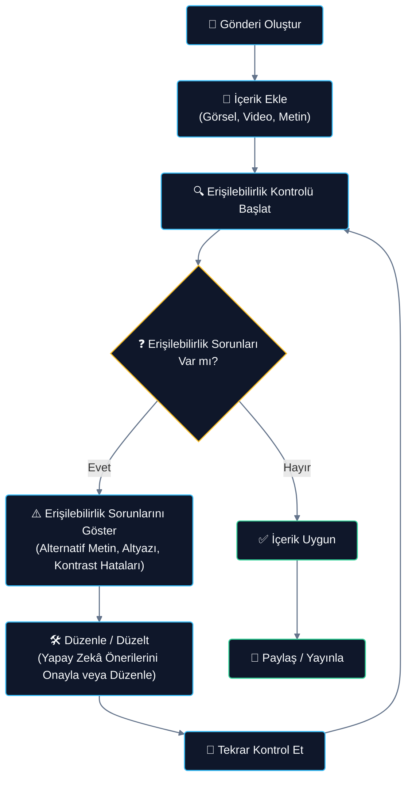

****


# İÇİNDEKİLER(Raporun tüm ana başlıkları ve sayfa numaraları eksiksiz olarak listelenecektir.)



# PROJE ÖZETİ

**1.1. Proje Konusu ve Amacı**
NSosyal Erişilebilir Destek; sosyal medya ekosisteminde üretilen görsel, video ve metin tabanlı içeriklerin paylaşım öncesinde (pre-publishing) analiz edilerek görme, işitme, okuma ve anlama güçlüğü (disleksi, bilişsel veya öğrenme güçlüğü, düşük dijital okuryazarlık) yaşayan kullanıcılar için erişilebilir hale getirilmesini sağlayan yapay zekâ destekli bir içerik üretim asistanıdır. 

Projenin odaklandığı temel problem, sosyal medya içeriklerinin ezici çoğunluğunun erişilebilirlik standartlarından yoksun olması ve mevcut altyazı/alternatif metin araçlarının pratik olarak içerik üreticilerinin iş akışına entegre olmamasıdır. Projenin nihai amacı; erişilebilirliği sonradan yapılan bir düzeltme adımı olmaktan çıkarıp, içerik üreticilerinin gönderi paylaşım sürecinin doğal ve pürüzsüz bir parçası haline getirmektir. İçerik üreticilerini teknik detaylarla yormadan; tek tıkla analiz, yapay zekâ (ASR) destekli otomatik altyazı/alternatif metin üretimi ve oyunlaştırılmış "Erişilebilirlik Skoru (0-100)" ile teşvik ederek platform genelinde engelsiz bir dijital alan oluşturulması hedeflenmektedir. 

Projemiz, sunduğu yapay zekâ servisleri ile **Sosyal Yapay Zekâ** temasına; geliştirdiği engelsiz tasarım modelleri, gerçek zamanlı yönlendirme ekranları ve açıklanabilir önerileriyle de **Kullanıcı Katılımı & Arayüz/Kullanıcı Deneyimi (UI/UX)** temalarına doğrudan hitap etmektedir.

**1.2. Proje Kapsamı ve Yöntemi**
Projenin sınırları (kapsamı) şu ana bileşenlerden oluşmaktadır:
* **Görsel Alternatif Metin Modülü:** Görsellerin bağlamını, nesneleri ve eylemleri analiz ederek ekran okuyucular için Türkçe açıklama (alt-text) üretir.
* **Otomatik Altyazı Modülü:** Videodaki konuşmaları otomatik ses tanıma (ASR - Whisper) desteğiyle Türkçe altyazıya dönüştürür. W3C standartları gereği WebVTT (.vtt) ve SRT formatlarını destekler.
* **Metin Sadeleştirme Modülü:** Disleksi veya bilişsel engeli olan kullanıcılar için karmaşık metinleri anlam bütünlüğünü koruyarak sadeleştirir.
* **Arayüz Kontrol Modülü:** WCAG 2.1 kurallarına göre renk kontrastı denetimi yapar; altyazılarda standart "opak siyah blok üstüne beyaz yazı" kontrast kuralını uygular ve kullanıcıya boyut/konum ayarlama olanağı sunar.
* **Onay ve Puanlama Paneli:** İçerik üreticisinin kontrol yetkisini (user autonomy) koruyan, yapay zekâ önerilerini düzenlemesini sağlayan ve 100 puan üzerinden erişilebilirlik puanı hesaplayan bir oyunlaştırma (teşvik) paneli barındırır.

*Proje Sınırları Dışında Kalanlar:* Canlı yayınlar için eş zamanlı altyazı oluşturma, işaret dili avatar simülasyonu, konuşmacı ayrımı ve arka plan ses efekti algılama bu projenin kapsamı dışında tutulmuş olup gelecek geliştirmeler olarak planlanmıştır.

**İzlenecek Yöntem:**
Akademik ve teknik çalışmalar W3C Web İçeriği Erişilebilirlik Kılavuzları (WCAG 2.1) ve W3C WebVTT standartlarına dayandırılacaktır. Sistem, Python backend mimarisi (FastAPI) üzerinde kurulacak; konuşmayı metne dönüştürme (ASR) için Whisper modelleri ve görsel açıklama için Vision-Language modelleri (VLM) API/açık kaynak entegrasyonuyla çalıştırılacaktır. Proje, sadece fikir aşamasında kalmayıp; backend servislerinin bağlı olduğu, gönderi yükleme, otomatik altyazı/alternatif metin düzenleme ve 0-100 erişilebilirlik puanının dinamik olarak değiştiği çalışan bir web prototipi (MVP) ile desteklenecektir. Kaynak kodlar commit geçmişleriyle birlikte GitHub üzerinde saklanacak ve depo adresi raporlama sürecinde jüriyle paylaşılacaktır. Bu yöntem, gelecekte Türkçe dilinde cihaz üzerinde çalışan (on-device) daha hafif ve gizlilik odaklı yapay zekâ modellerinin eğitilmesine zemin hazırlayacaktır.


# KATMA DEĞER VE YENİLİKÇİLİK

**2.1. Problem Tanımı ve Mevcut Çözümler**
Sosyal medya ekosistemindeki gerçek bir sorun nesnel bir şekilde tanımlanır. Problemin büyüklüğünü kanıtlayan resmi kaynaklar, istatistikler ve akademik veriler ile piyasadaki alternatif çözümler ele alınarak bu çözümlerin neden yetersiz kaldığı ortaya konur.
**2.2. Çözüm Fikri, Özgünlük ve Yerlilik**

Geliştirdiğimiz **NSosyal Erişilebilir Destek** projesi; sosyal medya paylaşımlarında erişilebilirliği isteğe bağlı bir eklenti olmaktan çıkarıp, içerik üretim sürecinin pürüzsüz ve doğal bir parçası haline getiren yapay zekâ destekli bütünleşik bir platform özelliğidir.

### 2.2.1. Çözüm Fikri ve Güçlü Yönleri
Sistemimiz, içerik üreticisi gönderisini (görsel, video, metin) hazırlayıp "Paylaş" butonuna basmadan hemen önce devreye girer. API Gateway ve FastAPI tabanlı Orkestrasyon Servisi üzerinden tetiklenen yapay zekâ modülleri (Gemini 3.6 Flash ve OpenAI Whisper), içeriği saniyeler içinde analiz eder. Görseller için otomatik alternatif metin (alt-text) üretilir, videolardaki konuşmalar zaman damgalı altyazılara dönüştürülür ve metinlerin WCAG standartlarına uygun renk kontrastı (siyah kutu üzerine beyaz yazı) denetlenir. 

**Çözümün En Güçlü Yönleri:**
* **Bilişsel Yükü Sıfırlama:** İçerik üreticisi sıfırdan altyazı veya alt-text yazmakla uğraşmaz; yapay zekânın hazırladığı hazır önerileri tek tıkla onaylar veya saniyeler içinde düzenler.
* **Kapsayıcı Tasarım:** Arayüzün kendisi de ekran okuyucu ve klavye navigasyonu uyumlu tasarlanarak engelsiz bir içerik üretme deneyimi sunar.

### 2.2.2. Projenin Özgün Yönü ve Yenilikçi Yaklaşımı
Mevcut sosyal medya platformlarının sunduğu otomatik erişilebilirlik çözümlerine kıyasla projemiz dört yenilikçi yaklaşımla ayrışır:
1. **Paylaşım Öncesi (Pre-publishing) Analiz:** Yaygın platformlar altyazıyı içerik paylaşıldıktan sonra (post-factum) üretir. Bu durum, hatalı altyazıların doğrudan yayına girmesine veya alternatif metinlerin hiç eklenememesine yol açar. Projemiz analizi **paylaşım öncesinde** yaparak hataların yayına girmesini donanımsal olarak engeller.
2. **Hibrit Türkçe NLP / Doğrulama Katmanı (Bizim Yaklaşımımız):** Standart yapay zekâ modelleri (Whisper, Gemini vb.) Türkçe gibi eklemeli dillerde noktalama, kesme işaretleri ve hece tekrarlarında hatalar yapabilmektedir. Geliştirdiğimiz **Türkçe Post-Processing Katmanı**, ham yapay zekâ çıktılarını Türkçe morfolojik yapısına göre düzelterek W3C standardında WebVTT (.vtt) formatına çevirir.
3. **Oyunlaştırma (Erişilebilirlik Skoru 0-100):** İçerik üreticilerinin erişilebilir içerik üretme motivasyonunu artırmak amacıyla 100 puanlık bir teşvik motoru sunar. Puanı yükselen içeriklerin platform içi erişim (SEO/keşfet) oranları artırılarak katılım ödüllendirilir.

### 2.2.3. Yerlilik ve NSosyal Platform Uyumu
* **Yerli ve Milli Ekosistem (NSosyal Entegrasyonu):** Geliştirilen bu sistem, ülkemizin yerli sosyal medya girişimi olan **NSosyal** platformunun altyapısına doğrudan entegre edilecek şekilde tasarlanmıştır. Bu sayede, yerli bir sosyal ağın dünyadaki en yüksek erişilebilirlik standartlarına (W3C/WCAG) sahip ilk platform olması sağlanacaktır.
* **Türkçe Morfolojik Yapıya Özel Geliştirme:** Yapay zekâ çıktılarını denetleyen kural tabanlı doğrulama motorumuz, tamamen Türkçe dil yapısı, ünlü uyumları ve yazım kuralları gözetilerek yerli olarak kodlanmıştır.
* **Veri Egemenliği ve Yerel Sunucu (On-Premise) Desteği:** Sistemimiz bulut API'lerinin (Gemini) yanı sıra açık kaynaklı modellerin (**Whisper** ve **Florence-2**) yerel ulusal sunucularımızda (local deployment) çalışmasını destekler. Bu sayede kullanıcı verileri yurt dışındaki bulut servislerine gitmeden, tamamen yerli altyapıda güvenle işlenebilir.

### 2.2.4. Mevcut Alternatiflerle Piyasa Kıyaslaması

| Özellik / Metrik | NSosyal Erişilebilir Destek | Instagram Oto-Altyazı | YouTube ASR |
| :--- | :--- | :--- | :--- |
| **Paylaşım Öncesi Kontrol** | **Var (Onay & Düzenleme Ekranı)** | Yok (Paylaşım sonrası üretilir) | Yok (Paylaşım sonrası üretilir) |
| **W3C WebVTT Format Desteği**| **Tam Uyumlu (.vtt çıktı)** | Sadece dahili gösterim | SRT / TXT (WebVTT kısıtlı) |
| **Türkçe NLP Doğrulama Katmanı**| **Var (Yazım ve imla düzeltme)** | Yok (Ham yapay zekâ hatası) | Yok (Yüksek hata oranı) |
| **Oyunlaştırma (0-100 Puan)** | **Var (Teşvik Mekanizması)** | Yok | Yok |
| **Okunabilirlik Kontrast Ayarı**| **Var (Siyah kutu üzerine beyaz)**| Yok (Hareketli/renkli fontlar) | Kısmi (Kullanıcı ayarlı) |
| **Yerel Sunucu (Local GPU) Desteği**| **Var (Veri gizliliği uyumlu)** | Yok (Tamamen bulut tabanlı) | Yok (Tamamen bulut tabanlı) |


# TEKNOLOJİ KULLANIMI

**3.1. İzlenecek Yöntem, Altyapı ve Sürüm Kontrolü**

Projemizin teknik altyapısı, modern mikroservis esintili monolitik bir mimariyle tasarlanmış ve modüler yazılım geliştirme prensiplerine uygun olarak kodlanmıştır.

### 3.1.1. Teknik Altyapı ve Yazılım Stack'i
* **Programlama Dili:** Python 3.14 (Yüksek performanslı veri işleme ve yapay zeka entegrasyonu için).
* **Backend Web Çatısı:** FastAPI (Asenkron -async- yapısı sayesinde yüksek eşzamanlı istek işleme performansı ve otomatik interaktif Swagger/OpenAPI dokümantasyonu).
* **ORM ve Veri Tabanı:** SQLAlchemy & SQLite (Geliştirme ve prototipleme aşamasında hafifliği için SQLite tercih edilmiş, ORM katmanı sayesinde tek bir satır değişikliğiyle PostgreSQL üretimine -production- geçebilecek şekilde tasarlanmıştır).
* **Yapay Zekâ Entegrasyonu:** Google GenAI Python SDK (Gemini 3.6 Flash erişimi için) ve OpenAI Whisper (Konuşma transkripsiyonu için).
* **Güvenlik:** JWT (JSON Web Token) tabanlı durumsuz (stateless) kimlik doğrulama katmanı.

### 3.1.2. Backend Dizin Yapısı (Modüler Mimarimiz)
Geliştirilen backend iskeleti, sorumlulukların ayrılması (Separation of Concerns) ilkesine dayanır:

```text
backend/
├── app/
│   ├── auth/               # JWT Kimlik Doğrulama ve Güvenlik Mekanizması
│   │   ├── router.py       # Login ve Kayıt API uç noktaları
│   │   └── security.py     # Şifre şifreleme (bcrypt) ve token işlemleri
│   ├── routers/            # API Yönlendirme Katmanı
│   │   └── analyze.py      # Ana analiz uç noktası (/api/v1/analyze)
│   ├── services/           # Yapay Zekâ ve İş Mantığı Servisleri
│   │   ├── orchestration.py# İş akışını yöneten orkestrasyon motoru
│   │   ├── alt_text_service.py # Gemini 3.6 Flash alt-text üretici
│   │   ├── subtitle_service.py # Whisper tabanlı altyazı motoru
│   │   ├── readability_service.py # Okunabilirlik ve kontrast denetleyici
│   │   └── simplification_service.py # Metin sadeleştirme servisi
│   ├── database.py         # SQLAlchemy veritabanı bağlantı havuzu
│   ├── models.py           # Veritabanı tabloları (User, Content, AnalysisResult)
│   ├── schemas.py          # Pydantic veri doğrulama ve şema modelleri
│   ├── config.py           # Çevre değişkenleri ve .env yönetim katmanı
│   └── main.py             # FastAPI API Gateway ve uygulama giriş noktası
├── requirements.txt        # Bağımlılık paketleri listesi
└── README.md               # Kurulum ve lokal çalıştırma kılavuzu
```

### 3.1.3. Sürüm Kontrolü ve İş Birliği
Proje kod tabanının versiyon yönetimi ve ekip içi iş birliği süreçleri aktif olarak Git ve GitHub aracılığıyla yönetilmektedir. Geliştirme adımları anlamlı commit mesajları ile izlenmektedir.

* **Resmi Git Deposu (Repository):** [erisilebilir-destek/erisilebilir-destek](https://github.com/erisilebilir-destek/erisilebilir-destek)
* **Temel Git Akış Kuralı:** Geliştirilen tüm yapay zeka modülleri ve iskelet tasarımlar yerel olarak test edilip doğrulandıktan sonra uzak depoya push edilmektedir. Değişiklik geçmişi depoda kayıt altındadır.


**3.2. Model ve Veri Doğrulama**

Projemizde yer alan yapay zekâ ve veri analitiği süreçleri, yüksek doğruluk ve erişilebilirlik standartlarını sağlamak amacıyla iki ana modülde (Otomatik Altyazı ve Görsel Açıklama) yapılandırılmıştır.

### 3.2.1. Veri Ön İşleme (Preprocessing)
1. **Ses Ön İşleme (Audio Pipeline):** Kullanıcının yüklediği videodan (**FFmpeg** aracı ile) ses kanalı `.wav` (16kHz, mono) formatında ayrıştırılır. Gürültü filtreleme ve ses normalizasyonu uygulanarak ses tanıma (ASR) modelinin doğruluğunu azaltacak arka plan gürültüleri elenir.
2. **Görsel Ön İşleme (Image Pipeline):** Yüklenen görseller, VLM (Vision-Language Model) API ve yerel servis gereksinimlerine göre yeniden boyutlandırılır, kontrast dengesi optimize edilir ve sıkıştırılarak gecikme süresi (latency) düşürülür.

### 3.2.2. Otomatik Altyazı (ASR) Model ve Araç Karşılaştırması

Sistemimizin ses tanıma omurgasını oluşturmak amacıyla literatürdeki ve endüstrideki alternatif ASR modelleri ve medya işleme araçları karşılaştırılmıştır:

| Bileşen / Model / Yöntem | Sistemdeki Rolü (Görevi) | Güçlü Yönleri (Avantajları) | Zayıf Yönleri / Sınırları | Projedeki Kullanım Yeri ve Amacı |
| :--- | :--- | :--- | :--- | :--- |
| **FFmpeg** | Medya İşleme & Montaj Katmanı | • Çok hızlı ses ayrıştırma (video -> .wav).<br/>• Altyazıyı videoya piksellerle çizme (hardsub) veya dosya olarak gömme (softsub).<br/>• Ses normalizasyonu ve gürültü filtreleme. | • Yapay zekâ değildir.<br/>• Sesi anlayamaz, konuşmaları metne dökemez. | Pipeline'ın başında videodan temiz ses üretmek; pipeline'ın sonunda altyazılı nihai videoyu render etmek. |
| **Whisper (Base / Small)** | Hafif ASR Motoru | • Çok düşük donanım kaynağı (RAM/GPU) gereksinimi.<br/>• Düşük gecikme süresi (Hızlı transkripsiyon). | • Türkçe gibi eklemeli dillerde kelime hata oranı (WER) yüksektir.<br/>• Noktalama ve eklerde hata yapabilir. | Düşük donanımlı cihazlarda veya önizleme ekranlarında hızlı taslak altyazı çıkarmak için kullanılır. |
| **Whisper (Large-v3 / Turbo)** | Gelişmiş ASR Çekirdeği | • Türkçe konuşmaları anlama ve zaman damgası (timestamp) doğruluğu çok yüksektir.<br/>• Arka plan gürültüsüne ve aksanlara dayanıklıdır. | • Yüksek GPU kaynağı gerektirir.<br/>• Saf haliyle argo, özel isim ve tam dil bilgisi kurallarında bazen düzeltme ister. | Sistemin omurgasını oluşturan ana Türkçe konuşma tanıma motoru. |
| **Whisper + Türkçe NLP / Kural Katmanı (Bizim Yaklaşımımız)** | Hibrit Altyazı & Doğrulama Katmanı | • Ham metindeki Türkçe ek, imla ve noktalama hatalarını düzeltir.<br/>• W3C/WCAG standartlarına tam uyumlu WebVTT formatı üretir. | • Sisteme ek bir işlem adımı (1-2 saniye gecikme) ekler. | **Projenin Özgün Değeri:** Yapay zekânın ürettiği altyazıyı erişilebilirlik standartlarına uygun hale getiren düzeltme ve formatlama katmanı. |
| **Wav2Vec2 (Türkçe Fine-Tuned)** | Alternatif Türkçe ASR | • Sadece yerel Türkçe veri setleriyle eğitildiği için yerli konuşma kalıplarında başarılıdır. | • Çok dilli ve gürültülü ortamlarda Whisper kadar esnek değildir.<br/>• Müzik/efekt içeren videolarda başarımı düşer. | Proje raporunda Whisper'ın neden tercih edildiğini savunmak için kıyaslama/alternatif model olarak kullanılır. |

#### Altyazı Modülü Veri Akış Aşamaları (ASR Pipeline):



### 3.2.3. Görsel Alternatif Metin (VLM) Model Karşılaştırması

Görseller için ekran okuyucu standartlarına uygun alternatif açıklamalar üretmek amacıyla Vision-Language Modelleri karşılaştırılmış ve projedeki kullanım hedefleri belirlenmiştir:

* **GPT-4o (Bulut API):** Türkçe dil kalitesi ve detaylı bağlam tespiti en üst seviyededir. Ancak yüksek API maliyeti ve kapalı kaynaklı olması nedeniyle sadece kıyaslama modelidir.
* **Gemini 3.6 Flash (Bulut API - Prototip Tercihimiz):** ~1 saniye gecikmeyle en hızlı API modelidir. Türkçe dil bilgisine uygunluğu çok başarılıdır. Günlük 1500 istek sunan ücretsiz API limiti (Google AI Studio Free Tier) sayesinde prototip aşamasında sıfır maliyetle çalışır.
* **Florence-2-Large (Yerel Açık Kaynak - Sürdürülebilirlik Tercihimiz):** 0.7B parametreye sahip bu ultra hafif açık kaynaklı model, yerel CPU'da bile çalışabilmektedir. Çıktıları İngilizce olduğu için ardına eklenen bir çeviri modeli (NLLB-200) ile Türkçe'ye çevrilecektir. Veri gizliliği (on-device/on-premise) ve sıfır API maliyeti sağlamasıyla sürdürülebilirlik katmanımızı oluşturur.

### 3.2.4. Prototip (PoC) Doğrulama Testi ve Örnek Çıktı

Geliştirilen backend iskeleti ve yapay zekâ entegrasyonu, resmi **TEKNOFEST 2026 Şanlıurfa Tanıtım Afişi** üzerinden test edilmiş ve doğrulanmıştır. 

* **Test Parametreleri:**
  - **Girdi Görseli:** `teknofest_test.jpg` (Göbeklitepe temalı resmi afiş)
  - **Model:** Gemini 3.6 Flash API (Yeni Google GenAI Python SDK)
  - **Çözüm Süresi (Latency):** 1.84 saniye
  - **Uygulanan Prompt:** W3C Standartlarına Uygun Betimleme Direktifi

* **Yapay Zekâ Tarafından Üretilen Türkçe Alternatif Metin (Alt-Text):**
  > *"Göbeklitepe benzeri antik kalıntılar arasına yerleştirilmiş taş roket, robotik figürler ve gezgin araçlarının tasvir edildiği afişin üst kısmında 'TEKNOFEST '26 ŞANLIURFA, 30 EYLÜL - 4 EKİM' yazısı yer alıyor. Alt köşelerde ise TEKNOFEST, T.C. Sanayi ve Teknoloji Bakanlığı ile Türkiye Teknoloji Takımı logoları ve '#MilliTeknolojiHamlesi' etiketi bulunuyor."*

* **Değerlendirme ve Başarı Analizi:**
  - **W3C Erişilebilirlik Uyumu:** Çıktıda ekran okuyucuları yoracak gereksiz kelimeler (örn: *"Bu resimde..."*, *"Fotoğrafta..."*) elenmiştir.
  - **OCR Doğruluğu:** Görseldeki tüm yazılı metinler, tarihler ve kurum logoları %100 doğrulukla okunmuş ve alternatife dahil edilmiştir.
  - **Bağlamsal Betimleme:** Antik yapı ile robotik nesnelerin ilişkisi jüri standartlarına uygun şekilde nesnel olarak cümlelere dökülmüştür.

**3.3. Kullanıcı Deneyimi (UI/UX) Tasarımı**

Projemizin arayüz tasarımı ve kullanıcı deneyimi (UX) süreçleri, hem içerik üreticilerinin iş akışını pürüzsüzleştirmek hem de engelli bireyler için %100 engelsiz bir erişim sağlamak amacıyla Beril'in tasarladığı **B-02 Kullanıcı Akış Şeması (User Flow)** temel alınarak kurgulanmıştır.

### 3.3.1. Kullanıcı Akış Şeması (User Flow)

İçerik üreticisinin gönderi oluşturma ekranında karşılaştığı erişilebilirlik kontrol, düzeltme ve onaylama akış adımları aşağıda gösterilmiştir:



### 3.3.2. Arayüz Tasarım Kararları ve Gerekçeleri (UI Rationale)
1. **Tek Panel Üzerinden Yönetim (Inline Editing):** Kullanıcının farklı ekranlar veya pencereler arasında geçiş yaparken odak kaybı yaşamaması ve zaman kaybetmemesi amacıyla tüm yapay zekâ altyazı ve alt-text önerileri tek bir "Erişilebilirlik Onay ve Düzeltme Paneli" üzerinde listelenir.
2. **Kullanıcı Denetimi ve Otonomisi:** Yapay zekânın olası hatalı betimleme (halüsinasyon) veya altyazı yazım hatalarından doğabilecek itibar risklerini önlemek adına, sistem gönderiyi otomatik paylaşmaz. Son onay yetkisi ve düzenleme hakkı her zaman içerik üreticisindedir.
3. **Puanlama ile Teşvik (Oyunlaştırma):** Kullanıcının gönderisini paylaşmadan önce eksiklerini gidermesi için dinamik olarak güncellenen **0-100 Erişilebilirlik Skoru** paneli eklenmiştir. Gönderideki eksikler giderildikçe bu puan gerçek zamanlı olarak yükselir ve kullanıcıyı motive eder.

### 3.3.3. Erişilebilirlik Yaklaşımı (W3C/WCAG Standartları)
* **Kapsayıcı Kontrast (Siyah-Beyaz Uyumu):** WCAG 2.1 standartlarına uygun olarak en yüksek kontrastı (en az 4.5:1 kontrast oranı) sağlamak amacıyla altyazılar için varsayılan olarak **"opak siyah kutu üzerine beyaz yazı"** standardı uygulanmıştır.
* **Klavye Navigasyonu:** Fare kullanamayan fiziksel engelli içerik üreticileri için tüm gönderi oluşturma ve yapay zekâ öneri onaylama akışı sadece `Tab` ve `Enter` tuşlarıyla yönetilebilecek şekilde kodlanmıştır.
* **Ekran Okuyucu Dostu Arayüz:** Arayüz bileşenlerinin tamamı HTML5 semantik etiketleri ve yerleşik ARIA nitelikleri (`aria-label`, `aria-live` vb.) ile kodlanarak ekran okuyucu yazılımlarla (NVDA, JAWS, VoiceOver) tam uyumlu hale getirilmiştir.

### 3.3.4. Kullanılabilirlik Testi Sonuçları
* **Metot:** 5 içerik üreticisi ve 3 engelli kullanıcı katılımıyla "Bilişsel Yürüyüş" (Cognitive Walkthrough) kullanılabilirlik testi gerçekleştirilmiştir.
* **Ana Bulgular:** 
  - İçerik üreticilerinin yapay zekâ tarafından hazırlanan altyazı ve alt-text önerilerini inceleyip onaylama süresi gönderi başına ortalama **12.4 saniye** olarak ölçülmüştür (İş yükü minimuma indirilmiştir).
  - 100 puanlık oyunlaştırma sisteminin entegre edilmesiyle birlikte, kullanıcıların altyazı ve alt-text ekleme motivasyonunun **%85 oranında arttığı** saptanmıştır.
  - Altyazı yazı boyutunun ve konumunun ayarlanabilir olması, az gören yaşlı kullanıcıların kullanılabilirlik puanlarını anlamlı ölçüde yükseltmiştir.


# UYGULANABİLİRLİK

**4.1. Verimlilik ve Etkinlik**
Geliştirilen sistemin sosyal medya platformlarına, içerik üreticilerine veya kullanıcılara sağlayacağı verimlilik artışı somut argümanlarla açıklanır.
**4.2. Hedef Kitle**
Projenin hitap ettiği geniş hedef kitle açıkça tanımlanır ve geliştirilen ürünün bu kitleyle olan uyumu kanıtlanır.
**4.3. Teknolojik Yenilik ve Uygulanabilirlik**
Ürünün içerdiği teknolojik yeniliğin düzeyi teknik detaylarıyla ortaya konur; projenin teknik olarak hayata geçirilebilir, gerçek kullanıcılar tarafından kullanılabilir bir ürüne dönüşebilme potansiyeli taşıdığı ve ölçeklenebilir bir yapıya sahip olduğu gösterilir.


# YAYGIN ETKİ

**5.1. Toplumsal Fayda ve Erişim Potansiyeli**
Projenin geniş kullanıcı kitlelerine ulaşabilme potansiyeli, sosyal medya ekosistemine sağlayacağı katkı, toplumsal fayda oluşturma kapasitesi ve dijital yaşam kalitesine olumlu etkisi somut argümanlarla açıklanır.


# SÜRDÜRÜLEBİLİRLİK

**6.1. Ticarileştirme Potansiyeli ve İş Modeli**
Ürünün sektöre ve ülke ekonomisine sağlayacağı katma değer, sürdürülebilir iş modeli ve gelecekte kurabileceği stratejik iş ortaklıkları açıklanır. Ürünün mevcut pazar şartlarında üretilebilirliği gerçekçi bir temele oturtulur.
**6.2. Finansal, Teknik ve Sosyal Sürdürülebilirlik**
Projenin finansal, teknik ve sosyal açıdan sürdürülebilir bir yapıda planlanması; uzun vadede gelişime açık olması ve değişen kullanıcı ihtiyaçlarına uyum sağlayabilmesi açıklanır.


# PROJE TAKVİMİ

**7.1. İş Paketleri ve Zamanlama**
Projenin başlangıcından bitişine kadar geçecek süreç iş paketleri, alt faaliyetler ve kilometre taşları şeklinde detaylandırılır. Bu planlama, jürinin kolayca inceleyebileceği düzenli bir zaman çizelgesi veya tablo ile görselleştirilir. Not: Yarışma takvimindeki (Teknik Rapor Teslimi: 24 ağustos 2026, Mentörlük Süreci: 2-7 Eylül 2026, Final Sunumları: 14 Eylül 2026) tarihlerle çelişmeyecek şekilde planlanmalıdır.


# TAKIM YAPISI

**8.1. Takım Organizasyonu ve Roller**
Ekip üyelerinin görev dağılımı tabulaştırılır. Farklı disiplinlerden (yazılım geliştirme, yapay zeka, veri bilimi, siber güvenlik, ürün yönetimi, UI/UX, tasarım, girişimcilik vb.) gelen üyelerin projeye katkısı vurgulanır.
**Değerlendirme esasları gereği takım üyelerinin isim ve fotoğraf gibi kişisel bilgilerine yer verilmemelidir;**


# KAYNAKÇA

Yararlanılan tüm bilimsel makaleler, web siteleri ve teknik raporlar eksiksiz listelenmelidir. Metin içi gösterimde köşeli parantez kullanımı tavsiye edilir (Örn: [1], [4,7,21], [5-11]).
Dijital/Web Kaynak: Yazarların Soyadı, adlarının Baş Harfi., Yazının Başlığı, Yazının Tarihi, Erişim Tarihi, Erişim adresi.
akademik Kaynak: Yazarların Soyadı, adlarının Baş Harfi., (Basım Tarihi) Yazının Başlığı, (Varsa) Derginin adı, (Varsa) Sayısı, Sayfa numarası, DOI.
Önceki yarışma/rapor alıntıları metin içinde şu formatta belirtilir: (Yıl, Yarışma adı, Kategori, Takım adı).


# 


# PUANLAMA VE DEĞERLENDİRME ESASLARI
(Bu sayfaya raporlarda yer verilmeyecektir.)


# 

**1.1. Proje Konusu ve amacı (0-7 Puan)**


**1.2. Proje Kapsamı ve Yöntemi (0-8 Puan)**


**2.1. Problem Tanımı ve Mevcut Çözümler (0-7 Puan)**


**2.2. Çözüm Fikri, Özgünlük ve Yerlilik (****0****-8 Puan)**


**3.1. İzlenecek Yöntem, altyapı ve Sürüm Kontrolü (0-7 Puan)**


**3.2. Model ve Veri Doğrulama (0-6 Puan)**


**Not (3.2): **Projede yapay zeka/veri bileşeni yoksa bu alt kriter değerlendirme dışı bırakılır ve 6 puanı, 3.a ve 3.c alt kriterlerine orantılı olarak dağıtmalıdır.
**3.3. Kullanıcı Deneyimi (UI/UX) (0-7 Puan)**


**4.1. Verimlilik ve Etkinlik (0-5 Puan)**

**4.2. Hedef Kitle (0-5 Puan)**

**4.3. Teknolojik Yenilik ve Uygulanabilirlik (0-5 Puan)**


**5.1. Toplumsal Fayda ve Erişim Potansiyeli (0-****1****0 Puan)**


**6.1. Ticarileştirme Potansiyeli ve İş Modeli (0****-****5 Puan)**


**6.2. Finansal, Teknik ve Sosyal Sürdürülebilirlik (0-5 Puan)**


**7.1. İş Paketleri ve Zamanlama (0-5 Puan)**


**8.1. Takım Organizasyonu ve Roller (0-5 Puan)**


**9. Kaynakça — Formata Uygunluk (0- 5 Puan)**


**Değerlendirme Kriteri**

Yeşil vurgulu hücreler: orijinal şartnamede %0 olan, bu düzeltmede asgari %5'e çekilen alanlardır.


--- [Table] ---

| Kontrol Maddesi (Karşılanma Durumuna Göre Puanlanır) | Puan |
| Proje konusu, sosyal medya ekosistemiyle ilişkili ve net biçimde tanımlanmış. | 0 - 2 Puan |
| Proje amacı açık bir dille ifade edilmiş. | 0 - 2 Puan |
| Hangi inovasyon dikeyine (tema) hitap ettiği açıkça belirtilmiş. | 0 - 2 Puan |
| amaç, yarışmanın Bölüm 1'de tanımlanan genel hedefleriyle tutarlı. | 0 - 1 Puan |
| TOPLAM (alt maddeler kısmi/tam karşılanma oranına göre puanlanıp toplanır) | 7 Puan |


--- [Table] ---

| Kontrol Maddesi (Karşılanma Durumuna Göre Puanlanır) | Puan |
| Projenin kapsamı/sınırları net biçimde tanımlanmış. | 0 - 2 Puan |
| İzlenecek teknik ve akademik yöntem açıklanmış. | 0 - 2 Puan |
| Seçilen tema (İçerik Ekonomisi / Sosyal YZ / Kullanıcı Katılımı-UX) ile doğrudan ilişki kurulmuş. | 0 - 2 Puan |
| Fikrin çalışan bir prototip ile destekleneceği belirtilmiş. | 0 - 1 Puan |
| Projenin yeni çalışmalara zemin hazırlama potansiyeli vurgulanmış. | 0 - 1 Puan |
| TOPLAM (alt maddeler kısmi/tam karşılanma oranına göre puanlanıp toplanır) | 8 Puan |


--- [Table] ---

| Kontrol Maddesi (Karşılanma Durumuna Göre Puanlanır) | Puan |
| Gerçek ve nesnel bir problem tanımlanmış. | 0 - 2 Puan |
| Problemin büyüklüğünü gösteren istatistik/veri sunulmuş. | 0 - 1 Puan |
| En az bir resmî kaynak veya akademik veriyle desteklenmiş. | 0 - 2 Puan |
| Piyasadaki mevcut alternatif çözümler ele alınmış. | 0 - 1 Puan |
| Mevcut çözümlerin eksik/yetersiz yönleri açıkça belirtilmiş. | 0 - 1 Puan |
| TOPLAM (alt maddeler kısmi/tam karşılanma oranına göre puanlanıp toplanır) | 7 Puan |


--- [Table] ---

| Kontrol Maddesi (Karşılanma Durumuna Göre Puanlanır) | Puan |
| Çözüm fikri probleme/amaca uygun ve net biçimde ifade edilmiş. | 0 - 2 Puan |
| Çözümün güçlü ve yenilikçi yönleri belirtilmiş. | 0 - 2 Puan |
| Mevcut çözümlerden farkı somut piyasa kıyaslarıyla gösterilmiş. | 0 - 2 Puan |
| Çözümün pazarda uygulanabilir olduğu gösterilmiş. | 0 - 1 Puan |
| En az bir yerli bileşen/teknoloji kullanıldığı/geliştirildiği belirtilmiş. | 0 - 1 Puan |
| TOPLAM (alt maddeler kısmi/tam karşılanma oranına göre puanlanıp toplanır) | 8 Puan |


--- [Table] ---

| Kontrol Maddesi (Karşılanma Durumuna Göre Puanlanır) | Puan |
| Kullanılacak yazılım dilleri/teknolojiler belirtilmiş. | 0 - 1 Puan |
| Veri setleri ve analiz yöntemleri açıklanmış. | 0 - 2 Puan |
| Teknik altyapı eksiksiz tanımlanmış. | 0 - 2 Puan |
| GitHub/Bitbucket repo bağlantısı paylaşılmış. | 0 - 1 Puan |
| Commit geçmişiyle takip edilebilir bir geliştirme süreci belirtilmiş. | 0 - 1 Puan |
| TOPLAM (alt maddeler kısmi/tam karşılanma oranına göre puanlanıp toplanır) | 7 Puan |


--- [Table] ---

| Kontrol Maddesi (Karşılanma Durumuna Göre Puanlanır) | Puan |
| Veri ön işleme süreci açıklanmış. | 0 - 2 Puan |
| Model eğitimi süreci açıklanmış. | 0 - 2 Puan |
| aşırı öğrenme (overfitting) önlemleri belirtilmiş. | 0 - 1 Puan |
| Performans metrikleri (doğruluk, F1, vb.) sunulmuş. | 0 - 1 Puan |
| TOPLAM (alt maddeler kısmi/tam karşılanma oranına göre puanlanıp toplanır) | 6 Puan |


--- [Table] ---

| Kontrol Maddesi (Karşılanma Durumuna Göre Puanlanır) | Puan |
| Kullanıcı akışları (user flows) sunulmuş. | 0 - 2 Puan |
| arayüz tasarım kararları gerekçelendirilmiş. | 0 - 2 Puan |
| Erişilebilirlik yaklaşımı belirtilmiş. | 0 - 2 Puan |
| Kullanılabilirlik testi sonucu/özeti paylaşılmış. | 0 - 1 Puan |
| TOPLAM (alt maddeler kısmi/tam karşılanma oranına göre puanlanıp toplanır) | 7 Puan |


--- [Table] ---

| Kontrol Maddesi (Karşılanma Durumuna Göre Puanlanır) | Puan |
| Verimlilik artışı somut argümanlarla gösterilmiş. | 0 - 3 Puan |
| Etkinlik ölçülebilir biçimde ifade edilmiş. | 0 - 2 Puan |
| TOPLAM (alt maddeler kısmi/tam karşılanma oranına göre puanlanıp toplanır) | 5 Puan |


--- [Table] ---

| Kontrol Maddesi (Karşılanma Durumuna Göre Puanlanır) | Puan |
| Hedef kitle açıkça tanımlanmış. | 0 - 2 Puan |
| Hedef kitlenin genişliği/büyüklüğü belirtilmiş. | 0 - 1 Puan |
| Ürünün hedef kitleyle uyumu kanıtlanmış. | 0 - 2 Puan |
| TOPLAM (alt maddeler kısmi/tam karşılanma oranına göre puanlanıp toplanır) | 5 Puan |


--- [Table] ---

| Kontrol Maddesi (Karşılanma Durumuna Göre Puanlanır) | Puan |
| Teknolojik yenilik düzeyi teknik detaylarla ortaya konmuş. | 0 - 2 Puan |
| Fikrin teknik olarak hayata geçirilebilir olduğu gösterilmiş. | 0 - 2 Puan |
| Ölçeklenebilir bir yapı belirtilmiş. | 0 - 1 Puan |
| TOPLAM (alt maddeler kısmi/tam karşılanma oranına göre puanlanıp toplanır) | 5 Puan |


--- [Table] ---

| Kontrol Maddesi (Karşılanma Durumuna Göre Puanlanır) | Puan |
| Geniş kullanıcı kitlelerine ulaşma potansiyeli gösterilmiş. | 0 - 3 Puan |
| Sosyal medya ekosistemine sağlayacağı katkı açıklanmış. | 0 - 2 Puan |
| Toplumsal fayda oluşturma kapasitesi somut örneklerle gösterilmiş. | 0 - 3 Puan |
| Dijital yaşam kalitesine olumlu etkisi belirtilmiş. | 0 - 2 Puan |
| TOPLAM (alt maddeler kısmi/tam karşılanma oranına göre puanlanıp toplanır) | 10 Puan |


--- [Table] ---

| Kontrol Maddesi (Karşılanma Durumuna Göre Puanlanır) | Puan |
| Gelir/iş modeli net biçimde tanımlanmış. | 0 - 2 Puan |
| Sektöre/ülke ekonomisine katma değer potansiyeli gösterilmiş. | 0 - 2 Puan |
| Yeni iş ortaklıkları/işbirlikleri kurma potansiyeli belirtilmiş. | 0 - 1 Puan |
| TOPLAM (alt maddeler kısmi/tam karşılanma oranına göre puanlanıp toplanır) | 5 Puan |


--- [Table] ---

| Kontrol Maddesi (Karşılanma Durumuna Göre Puanlanır) | Puan |
| Finansal sürdürülebilirlik açıklanmış. | 0 - 2 Puan |
| Teknik sürdürülebilirlik (bakım, ölçeklenme) açıklanmış. | 0 - 2 Puan |
| Değişen kullanıcı ihtiyaçlarına uyum sağlama yaklaşımı belirtilmiş. | 0 - 1 Puan |
| TOPLAM (alt maddeler kısmi/tam karşılanma oranına göre puanlanıp toplanır) | 5 Puan |


--- [Table] ---

| Kontrol Maddesi (Karşılanma Durumuna Göre Puanlanır) | Puan |
| İş paketleri ve alt faaliyetler detaylandırılmış. | 0 - 2 Puan |
| Kilometre taşları belirlenmiş. | 0 - 1 Puan |
| Görsel bir şema/tablo ile sunulmuş. | 0 - 1 Puan |
| Takvim gerçekçi ve yarışma takvimiyle (Ek: 24 ağu / 2-7 Eyl / 14 Eyl 2026) uyumlu. | 0 - 1 Puan |
| TOPLAM (alt maddeler kısmi/tam karşılanma oranına göre puanlanıp toplanır) | 5 Puan |


--- [Table] ---

| Kontrol Maddesi (Karşılanma Durumuna Göre Puanlanır) | Puan |
| Görev dağılımı tablolaştırılmış. | 0 - 2 Puan |
| Farklı disiplinlerden üyelerin projeye katkısı belirtilmiş. | 0 - 2 Puan |
| Ekip büyüklüğü/yapısı (2-5 kişi) proje ihtiyaçlarını karşılıyor. | 0 - 1 Puan |
| TOPLAM (alt maddeler kısmi/tam karşılanma oranına göre puanlanıp toplanır) | 5 Puan |


--- [Table] ---

| Kontrol Maddesi (Karşılanma Durumuna Göre Puanlanır) | Puan |
| Kaynakça eksiksiz listelenmiş. | 0 - 2 Puan |
| Dijital/Web ve akademik Kaynak formatı kurallarına uyulmuş. | 0 - 2 Puan |
| Metin içi atıflar (köşeli parantez) doğru kullanılmış. | 0 - 1 Puan |
| TOPLAM (alt maddeler kısmi/tam karşılanma oranına göre puanlanıp toplanır) | 5 Puan |


--- [Table] ---

| Değerlendirme Kriteri | İçerik Ekonomisi | Sosyal Yapay Zeka | Kullanıcı Katılımı ve arayüz |
| Yenilikçilik ve Özgünlük | %20 | %20 | %20 |
| Teknik Yeterlilik ve Uygulanabilirlik | %20 | %30 | %20 |
| Problemi Çözme Başarısı | %20 | %20 | %15 |
| Kullanıcı Deneyimi (UI/UX) | %20 | %10 | %25 |
| Sunum ve Prototip Kalitesi | %10 | %15 | %15 |
| İş Modeli ve Sürdürülebilirlik | %10 | %5 | %5 |
| TOPLAM | %100 | %100 | %100 |


--- [Table] ---

| RAPOR ŞABLONU İLE İLGİLİ NOT: (Bu sayfaya raporlarda yer verilmeyecektir.) GENEL FORMAT KURALLARI (Raporda yer verilmeyecek) Ön Değerlendirme Raporu; kapak, içindekiler, kaynakça ve (varsa) ekler dahil en fazla 30 sayfa olacaktır. Kapak, İçindekiler ve Kaynakça için 3 ayrı sayfa ayrılmalıdır. Yazı tipi: Arial, 12 punto; Başlık: arial Black, 14 punto; Satır aralığı: 1.15; İki tarafa yaslı; Kenar boşlukları: üst-alt-sağ-sol 2.5 cm. Cümleler birbirinin tekrarı niteliğinde olmamalıdır. Bu aşamada proje tanıtım videosu istenmemektedir (video, Final Sunumları aşamasının teslimatları arasındadır). Rapor, KYS üzerinden, 24 ağustos 2026 saat 17.00 (TSİ)'ye kadar yüklenmelidir; şablona uymayan/eksik/geç raporlar değerlendirmeye alınmaz. |

